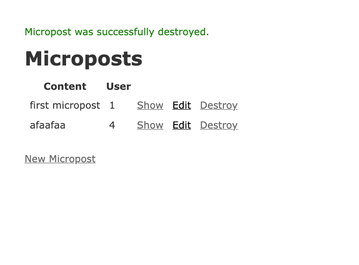
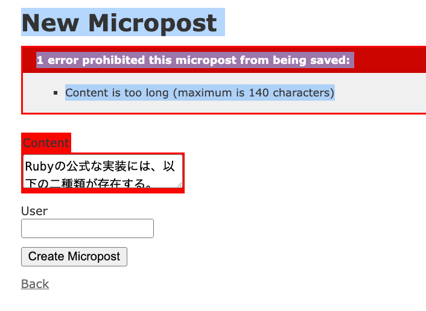
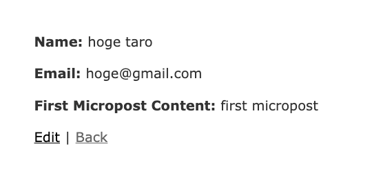
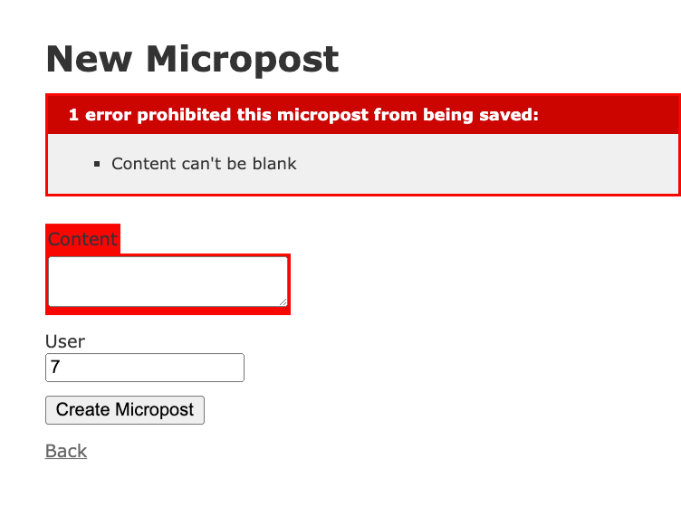
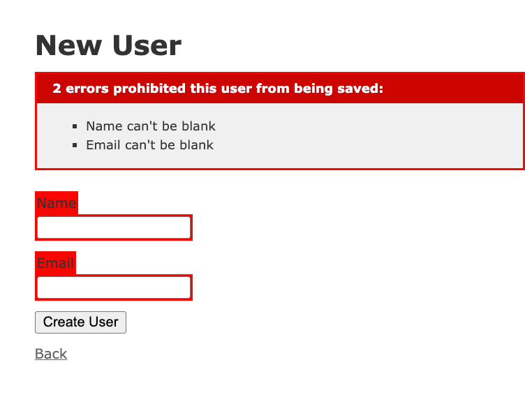
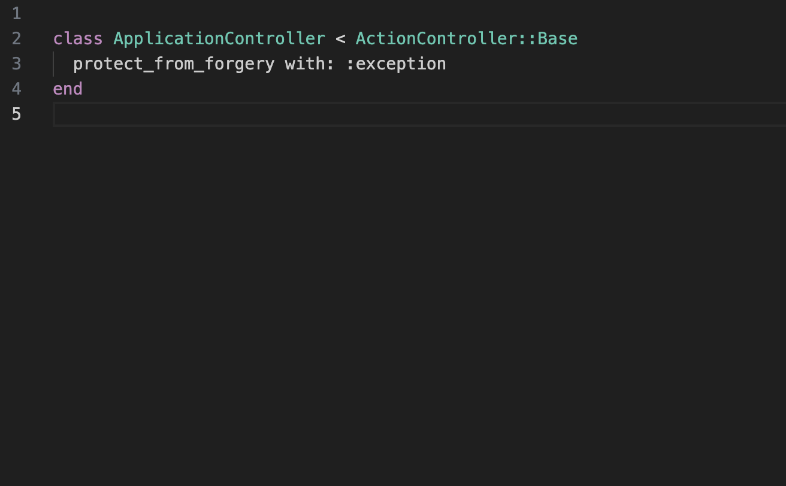
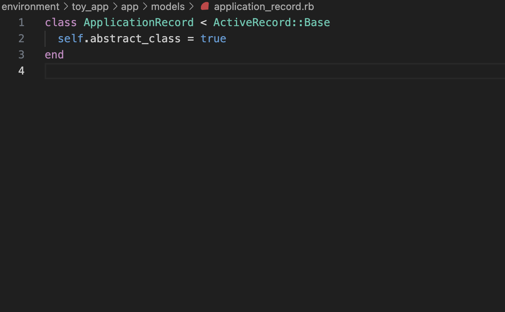

# 第一章
## チェックシート
1. Bundlerとはどのような役割のものでしょうか？
    - Rubyの依存関係管理ツール
    - Gemfilenに記述された依存関係を解決し、Gemfile.lockを使用してプロジェクトで使用されるgemの正確なバージョンを記録します。

2. MVCモデルとはどういったものでしょうか？以下の観点で説明してください。
    1. MVCモデルを構成している3つのものは何か。
        - Model
        - View
        - Controller
    2. MVCモデルを構成しているそれぞれのものの役割は何か。
        - Model
            - データベースとのやり取りや、データの検証、ビジネスルールの適用など、アプリケーションの「脳」のような役割を果たします
        - View
            - ユーザーに表示される要素（テキスト、ボタン、画像など）が含まれ、ユーザーが情報をどのように見るかを定義します
        - Controller
            - モデルとビューの間の通信を調整します。ユーザーからの入力を受け取り、モデルに命令を出し、モデルからのデータをビューに送信して、適切なレスポンスをユーザーに表示します

3. Railsのルーターとは、どのような役割を持っているものですか？
    - ルーターはコントローラとブラウザの間に配置され、ブラウザからのリクエストをコントローラに振り分ける (=ルーティング) 役割を果たします

4. Gitとはどのようなツールでしょうか？以下の単語を用いて説明してください。
・バージョン管理
・変更内容
    - Gitはプロジェクトに加えられた変更内容の履歴を追跡することができ、必要に応じて特定のバージョンに戻ることや、復元するしたりすることができます。これをバージョン管理といいます。

## 演習
1. Ruby on Railsで使うRuby gemはどのWebサイトにありますか？ヒント: 分からないときはとにかくググりましょう。  
    - https://rubygems.org/

2. 現時点でのRailsの最新バージョンはいくつですか？
    - 7.1

3. Ruby on Railsはこれまでに何回ダウンロードされたでしょうか？調べてみてください。
    - 470,964,388

4. デフォルトのRailsページに表示されているものと比べて、今の自分のコンピュータにあるRubyのバージョンはいくつになっていますか? コマンドラインでruby -vを実行することで簡単に確認できます。
    - 2.7.6

5. 同様にして、Railsのバージョンも調べてみましょう。調べたバージョンはリスト 1.1でインストールしたバージョンと一致しているでしょうか?
    - 5.1.6

6. リスト 1.7のhelloアクションを書き換え、「hello, world!」の代わりに「hola, mundo!」と表示されるようにしてみましょう。
    - 

7. Railsでは「非ASCII文字」もサポートされています。「¡Hola, mundo!」にはスペイン語特有の逆さ感嘆符「¡」が含まれています (図 1.20)13 。「¡」文字をMacで表示するには、Optionキーを押しながら1キーを押します。この文字をコピーして自分のエディタに貼り付ける方が早いかもしれません。
    - 

8. リスト 1.7のhelloアクションを参考にして、２つ目のアクションgoodbyeを追加しましょう。このアクションは、「goodbye, world!」というテキストを表示します。リスト 1.9のルーティングを編集して、ルートルーティングの割り当て先をhelloアクションからgoodbyeアクションに変更します (図 1.21)。
    - 

# 第二章
## チェックシート
1. 今回作成したToyアプリケーションのデータモデルは、どのような構成でしたか？ 
    - UserとMicropostから構成されています。Userモデルは、ユーザーの名前とメールアドレスの情報を持ち、Micropostモデルは、あるユーザーに属するマイクロポスト（投稿）の内容とユーザーIDを持っています。これらのモデル間には、一対多の関連付けがあり、1人のユーザーが複数のマイクロポストを持つことができます。

2. 今回作成したToyアプリケーションのデータモデルは、どのように関連付けされていましたか？
    - 一対多」の関係を使用しています。UserモデルとMicropostモデルが関連付けられており、一人のユーザー（User）が複数のマイクロポスト（Micropost）を持つことができます。

3. バリデーションとはどのようなものですか？
また、今回どのモデルのどの値に、どのようなバリデーションを実装しましたか？
    - バリデーションとはデータの正当性を検証するプロセスです。
    - Userモデル
        - nameとemailが空ではないか
    - Micropostモデル
        - contentが空ではないか、140字以内か
        - user_idが特定のユーザーと関連付けられているか
4. UserモデルやMicropostモデルはApplicationRecordを継承して何ができるようになりましたか？
「データベース」と「Ruby属性」を用いて説明してください。
    - データベースにアクセスできるようになり、データベースのカラムをあたかもRubyの属性のように扱えるようになります。
    - 開発者はSQLを書くことなくデータベースにアクセスできる

## 演習
1. CSSを知っている読者へ: 新しいユーザーを作成し、ブラウザのHTML検証機能を使って「User was successfully created.」の箇所を調べてみてください。ブラウザをリロードすると、その箇所はどうなるでしょうか?
    - pタグで囲まれていた「User was successfully created.」という文言が消える

2. emailを入力せず、名前だけを入力しようとした場合、どうなるでしょうか?
    - 名前だけ登録されたユーザーができる

3. 「@example.com」のような間違ったメールアドレスを入力して更新しようとした場合、どうなるでしょうか?
    - 間違ったアドレスのままユーザーが作成されてしまう

4. 上記の演習で作成したユーザーを削除してみてください。ユーザーを削除したとき、Railsはどんなメッセージを表示するでしょうか?
    - 「User was successfully destroyed.」

5. CSSを知っている読者へ: 新しいマイクロポストを作成し、ブラウザのHTML検証機能を使って「Micropost was successfully created.」の箇所を調べてみてください。ブラウザをリロードすると、その箇所はどうなるでしょうか?
    - pタグの中の文字が消える

6. マイクロポストの作成画面で、ContentもUserも空にして作成しようとするどうなるでしょうか?
    - ContentもUserも空のpostが作られる

7. 141文字以上の文字列をContentに入力した状態で、マイクロポストを作成しようとするとどうなるでしょうか? (ヒント: WikipediaのRubyの記事にある設計思想の引用文が140文字を超えているので、これをコピペしてみましょう)
    - そのまま作成される

8. 上記の演習で作成したマイクロポストを削除してみましょう。
    - 

9. 先ほど2.3.1.1の演習でやったように、もう一度Contentに141文字以上を入力してみましょう。どのように振る舞いが変わったでしょうか?
    - エラーが出る
    - 

10. CSSを知っている読者へ: ブラウザのHTML検証機能を使って、表示されたエラーメッセージを調べてみてください。
    - error_explanationというid名がついている
    - field_with_errorsというclass名がついている

11. ユーザーのshowページを編集し、ユーザーの最初のマイクロポストを表示してみましょう。同ファイル内の他のコードから文法を推測してみてください (コラム 1.2で紹介した技術の出番です)。うまく表示できたかどうか、/users/1 にアクセスして確認してみましょう。
    - 

12. リスト 2.16は、マイクロポストのContentが存在しているかどうかを検証するバリデーションです。マイクロポストが空でないことを検証できているかどうか、実際に試してみましょう (図 2.16のようになっていると成功です)。
    - 

13. リスト 2.17の（コードを書き込む）となっている箇所を書き換えて、Userモデルのnameとemailが存在していることを検証してみてください (図 2.17)。
    - 

14. Applicationコントローラのファイルを開き、ApplicationControllerがActionController::Baseを継承している部分のコードを探してみてください。
    - 

15. ApplicationRecordがActiveRecord::Baseを継承しているコードはどこにあるでしょうか? 先ほどの演習を参考に、探してみてください。ヒント: コントローラと本質的には同じ仕組みなので、app/modelsディレクトリ内にあるファイルを調べてみると...?
    - 