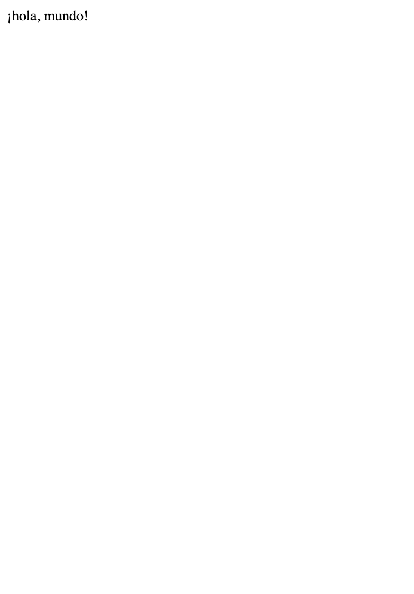

# 第一章
## チェックシート
1. Bundlerとはどのような役割のものでしょうか？
    - Rubyの依存関係管理ツール
    - Gemfilenに記述された依存関係を解決し、Gemfile.lockを使用してプロジェクトで使用されるgemの正確なバージョンを記録します。

2. MVCモデルとはどういったものでしょうか？以下の観点で説明してください。
    1. MVCモデルを構成している3つのものは何か。
        - Model
        - View
        - Controller
    2. MVCモデルを構成しているそれぞれのものの役割は何か。
        - Model
            - データベースとのやり取りや、データの検証、ビジネスルールの適用など、アプリケーションの「脳」のような役割を果たします
        - View
            - ユーザーに表示される要素（テキスト、ボタン、画像など）が含まれ、ユーザーが情報をどのように見るかを定義します
        - Controller
            - モデルとビューの間の通信を調整します。ユーザーからの入力を受け取り、モデルに命令を出し、モデルからのデータをビューに送信して、適切なレスポンスをユーザーに表示します

3. Railsのルーターとは、どのような役割を持っているものですか？
    - ルーターはコントローラとブラウザの間に配置され、ブラウザからのリクエストをコントローラに振り分ける (=ルーティング) 役割を果たします

4. Gitとはどのようなツールでしょうか？以下の単語を用いて説明してください。
・バージョン管理
・変更内容
    - Gitはプロジェクトに加えられた変更内容の履歴を追跡することができ、必要に応じて特定のバージョンに戻ることや、復元するしたりすることができます。これをバージョン管理といいます。

## 演習
1. Ruby on Railsで使うRuby gemはどのWebサイトにありますか？ヒント: 分からないときはとにかくググりましょう。  
    - https://rubygems.org/

2. 現時点でのRailsの最新バージョンはいくつですか？
    - 7.1

3. Ruby on Railsはこれまでに何回ダウンロードされたでしょうか？調べてみてください。
    - 470,964,388

4. デフォルトのRailsページに表示されているものと比べて、今の自分のコンピュータにあるRubyのバージョンはいくつになっていますか? コマンドラインでruby -vを実行することで簡単に確認できます。
    - 2.7.6

5. 同様にして、Railsのバージョンも調べてみましょう。調べたバージョンはリスト 1.1でインストールしたバージョンと一致しているでしょうか?
    - 5.1.6

6. リスト 1.7のhelloアクションを書き換え、「hello, world!」の代わりに「hola, mundo!」と表示されるようにしてみましょう。
    - 

7. Railsでは「非ASCII文字」もサポートされています。「¡Hola, mundo!」にはスペイン語特有の逆さ感嘆符「¡」が含まれています (図 1.20)13 。「¡」文字をMacで表示するには、Optionキーを押しながら1キーを押します。この文字をコピーして自分のエディタに貼り付ける方が早いかもしれません。
    - 

8. リスト 1.7のhelloアクションを参考にして、２つ目のアクションgoodbyeを追加しましょう。このアクションは、「goodbye, world!」というテキストを表示します。リスト 1.9のルーティングを編集して、ルートルーティングの割り当て先をhelloアクションからgoodbyeアクションに変更します (図 1.21)。
    - 